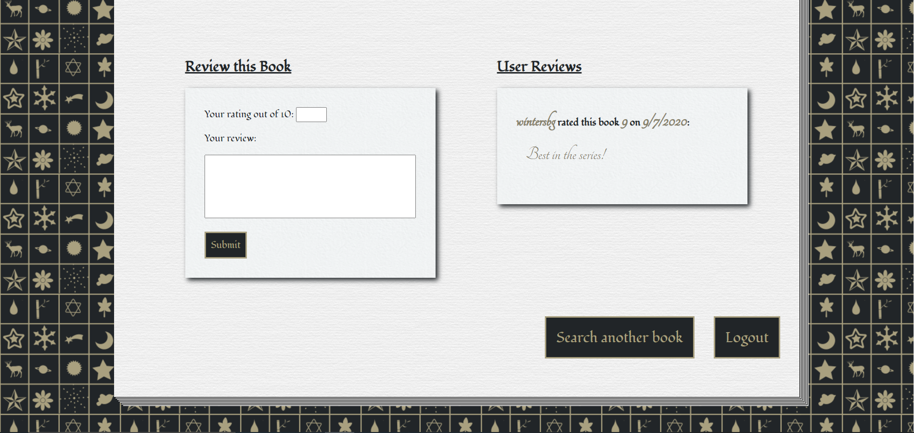

# Flask Book Reviews

A simple full-stack app in the style of Goodreads.

Features:

- Session-secured user registration.
- A search function to navigate the 5000 popular books in the SQL database.
- A dynamically templated page for each book result.
- Goodreads review statistics pulled from their developer's API.
- A review form to write a new row into to the SQL database -- the review will be joined to both the current user and the book.
- Viewing of all other reviews users of the site have left on the current book.

# API Route

This app offers a REST API interface to access review statistics that users of the site have left.

The access route is /api/isbn where 'isbn' is replaced with the ISBN number of the book for which you want to check current review statistics.
